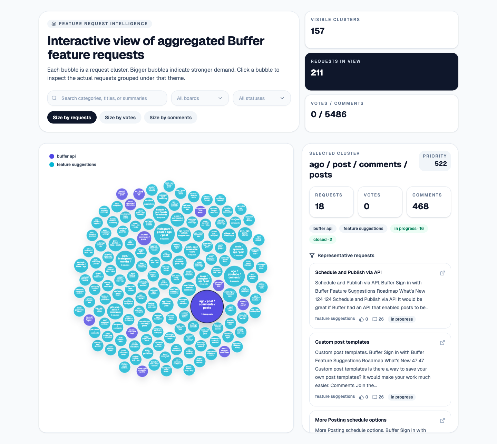

# Buffer Bubbles

Buffer Bubbles is an exploratory data visualization project for understanding what Buffer users are asking for on the public suggestion boards.

Live app: https://buffer-bubbles.danielubenjamin.com/



## Motivation

Public suggestion boards are useful, but they are not always enough.

A suggestion board is good at showing individual posts. It lets users submit ideas, vote, comment, and track whether something is open, planned, or in progress.

But when you are trying to understand product demand at a higher level, the raw board has a few problems.

### 1. Similar requests are scattered

Users often ask for the same thing in different ways.

For example:

```txt
Add WhatsApp support
Let me schedule messages to WhatsApp groups
Support WhatsApp Business
Post to WhatsApp communities
```

These may be separate posts, but they all point toward the same underlying product theme.

A normal suggestion board shows these as different requests. Buffer Bubbles tries to collapse them into a single category so the demand is easier to see.

### 2. Sorting by latest does not show importance

The latest request is not always the most important request.

A feature request posted today may have one vote, while an older request may represent a much larger recurring pain point. Looking only at the latest posts makes it easy to miss repeated themes.

Buffer Bubbles tries to make demand visible by grouping requests and showing cluster size, votes, and comments.

### 3. Votes alone can be misleading

A request with many votes may be important, but votes do not tell the whole story.

A stronger signal can come from a combination of:

```txt
number of similar requests
+ total votes
+ total comments
+ board/category
+ request status
```

Buffer Bubbles keeps those signals visible instead of hiding them inside individual posts.

### 4. Product research needs synthesis, not just browsing

If someone is preparing for a product, engineering, or growth conversation, they need more than a list of links.

They need to be able to say:

```txt
I found several independent requests around WhatsApp publishing.
They were not always worded the same way, but they cluster around the same user need.
The theme appears across multiple requests and has visible engagement.
```

That is the gap this project tries to close.

## What Buffer Bubbles does

Buffer Bubbles turns public Buffer suggestion data into an interactive feature-demand map.

At a high level, it:

1. crawls public Buffer suggestion pages,
2. extracts feature request content and metadata,
3. cleans and normalizes the request text,
4. converts each request into an embedding,
5. groups semantically similar requests into clusters,
6. scores and summarizes each cluster,
7. displays the clusters in an interactive bubble chart.

## Data flow

```txt
                         ┌────────────────────────────┐
                         │ Buffer suggestion boards    │
                         │ suggestions.buffer.com      │
                         └──────────────┬─────────────┘
                                        │
                                        │ crawl pages
                                        ▼
                         ┌────────────────────────────┐
                         │ Crawler                     │
                         │                            │
                         │ discovers request URLs      │
                         │ opens request pages         │
                         │ extracts visible content    │
                         └──────────────┬─────────────┘
                                        │
                                        │ raw request records
                                        ▼
                         ┌────────────────────────────┐
                         │ Normalizer                  │
                         │                            │
                         │ cleans title/body           │
                         │ keeps votes/comments/status │
                         │ builds summaries            │
                         └──────────────┬─────────────┘
                                        │
                                        │ clean documents
                                        ▼
                         ┌────────────────────────────┐
                         │ Embedding step              │
                         │                            │
                         │ title + body -> vector      │
                         │ similar meaning -> nearby   │
                         └──────────────┬─────────────┘
                                        │
                                        │ vectors
                                        ▼
                         ┌────────────────────────────┐
                         │ Clustering                  │
                         │                            │
                         │ groups similar requests     │
                         │ creates category candidates │
                         └──────────────┬─────────────┘
                                        │
                                        │ feature clusters
                                        ▼
                         ┌────────────────────────────┐
                         │ Scoring and summaries       │
                         │                            │
                         │ request count               │
                         │ total votes                 │
                         │ total comments              │
                         │ representative examples     │
                         └──────────────┬─────────────┘
                                        │
                                        │ JSON/CSV output
                                        ▼
                         ┌────────────────────────────┐
                         │ Interactive UI              │
                         │                            │
                         │ bubble chart                │
                         │ filters                     │
                         │ request drill-down          │
                         └────────────────────────────┘
```

## Repository structure

```txt
.
├── README.md
├── buffer-bubbles-home.png
├── Dockerfile
├── run.sh
├── crawler/
│   ├── pyproject.toml
│   ├── uv.lock
│   ├── rank.py
│   ├── main.py
│   ├── buffer_requests_raw.csv
│   ├── buffer_requests_clustered.csv
│   └── buffer_feature_clusters.json
└── frontend/
    ├── package.json
    ├── vite.config.ts
    └── src/
        ├── App.tsx
        ├── main.tsx
        ├── index.css
        ├── data/clusters.json
        └── components/ui/
```

Important files:

- `crawler/rank.py` — crawler, clustering, ranking, and output generation
- `run.sh` — runs the crawler and copies JSON into the frontend dataset
- `frontend/src/App.tsx` — the interactive UI
- `frontend/src/data/clusters.json` — the current frontend dataset
- `Dockerfile` — builds and serves the frontend as a static app

## Crawler architecture

The crawler is implemented in `crawler/rank.py`.

The source site is treated as a dynamic website rather than simple static HTML. That matters because many modern feedback tools render meaningful content on the client side. A plain HTTP request may only return shell HTML, while the actual posts appear after JavaScript runs.

Because of that, the crawler is designed around browser automation.

It uses:

- **Playwright** to load and inspect Buffer suggestion pages
- **BeautifulSoup** as a fallback parser for HTML extraction
- **pandas** to shape the extracted data into tables
- **sentence-transformers** to embed request text
- **scikit-learn / DBSCAN** to group semantically related requests

### Boards it starts from

The crawler starts from three board URLs:

```txt
https://suggestions.buffer.com/b/feature-suggestions
https://suggestions.buffer.com/b/new-channel-requests
https://suggestions.buffer.com/b/buffer-api
```

### Crawler flow

```txt
┌────────────────────────────────────────────────────────────┐
│ Crawler                                                     │
├────────────────────────────────────────────────────────────┤
│                                                            │
│  1. Open board page                                        │
│     Example: feature suggestions, new channel requests      │
│                                                            │
│  2. Wait for page content                                  │
│     Let the client-rendered UI load posts                  │
│                                                            │
│  3. Scroll through the board                               │
│     Trigger lazy-loaded results                            │
│                                                            │
│  4. Extract request links                                  │
│     Collect individual suggestion URLs                     │
│                                                            │
│  5. Visit each request page                                │
│     Extract title, body, status, votes, comments, board    │
│                                                            │
│  6. Deduplicate by URL                                     │
│     Avoid counting the same suggestion twice               │
│                                                            │
└────────────────────────────────────────────────────────────┘
```

The output of the crawler is a list of raw request records.

A request record looks conceptually like this:

```json
{
  "board": "feature suggestions",
  "url": "https://suggestions.buffer.com/...",
  "title": "Support posting to WhatsApp groups",
  "body": "It would be helpful if Buffer could...",
  "status": "open",
  "votes": 91,
  "comments": 16
}
```

The crawler does not decide what is important. It only collects the source data and preserves useful metadata for later analysis.

### Cache behavior

If `buffer_requests_raw.csv` already exists and `FORCE_CRAWL` is not set to `true`, the pipeline skips re-scraping and reconstructs items from the cached CSV via `load_cached_items(...)`.

That makes it easier to iterate on clustering and visualization without crawling the site every time.

## Why crawling is separated from clustering

The project separates crawling from clustering because those are different responsibilities.

```txt
Crawler responsibility:
Get the data

Clustering responsibility:
Understand the data

UI responsibility:
Let a human explore the data
```

This separation makes the system easier to debug.

If the UI looks wrong, the first question is:

```txt
Is the data wrong?
Is the clustering wrong?
Or is the visualization wrong?
```

Keeping the stages separate makes that easier to answer.

## Clustering architecture

The clustering step tries to answer one question:

```txt
Which requests are probably talking about the same underlying product need?
```

It does this using semantic similarity.

Instead of comparing only exact words, it converts each request into a vector representation. Requests with similar meaning should end up close to each other in vector space.

The current code builds a `combined_text` field from:

```txt
title + body
```

and then encodes it with:

```txt
SentenceTransformer("all-MiniLM-L6-v2")
```

Those embeddings are normalized and clustered using DBSCAN with cosine distance:

```txt
eps = 0.22
min_samples = 2
metric = "cosine"
```

### Clustering flow

```txt
┌────────────────────────────┐
│ Clean request text          │
│ title + body                │
└──────────────┬─────────────┘
               │
               ▼
┌────────────────────────────┐
│ Generate embeddings         │
│ one vector per request      │
└──────────────┬─────────────┘
               │
               ▼
┌────────────────────────────┐
│ Compare semantic distance   │
│ near vectors are similar    │
└──────────────┬─────────────┘
               │
               ▼
┌────────────────────────────┐
│ Cluster similar requests    │
│ each cluster = one theme    │
└──────────────┬─────────────┘
               │
               ▼
┌────────────────────────────┐
│ Generate category labels    │
│ from repeated terms         │
└──────────────┬─────────────┘
               │
               ▼
┌────────────────────────────┐
│ Score and rank clusters     │
│ count + votes + comments    │
└────────────────────────────┘
```

### Noise handling

DBSCAN can label isolated requests as noise (`-1`).

This project does not throw those requests away. Instead, each noise point gets a synthetic cluster id so every original request still appears in the final JSON and UI.

### Cluster labels

Cluster labels are generated heuristically by `keyword_label(...)`.

The code extracts tokens from grouped texts, removes a custom stopword list, counts frequent terms, and joins the top keywords with `/`.

That is why categories look like this:

```txt
ago / post / comments / posts
instagram / posts / ago / post
channel / ago / channels / accounts
```

These are not polished product labels. They are lightweight summaries meant to help navigation.

### Scoring

The crawler ranks clusters by:

1. `request_count`
2. `total_votes`
3. `total_comments`

descending.

The UI also computes a simple priority score:

```txt
priority_score =
  request_count * 3
  + total_votes * 2
  + total_comments
```

This is intentionally simple. The point is not to claim final truth, but to make repeated demand easier to compare.

## Cluster output

A cluster represents a product theme plus the evidence behind it.

Each cluster record in the JSON includes things like:

- `cluster_id`
- `category`
- `request_count`
- `boards`
- `statuses`
- `total_votes`
- `total_comments`
- `representative_titles`
- `representative_urls`
- `items`

That means the UI does not just say:

```txt
This theme is popular
```

It can also show the underlying request threads behind that claim.

## Why a bubble chart?

The UI uses a bubble chart because the main thing we want to see is concentration.

A table can show exact numbers, but it does not immediately show the shape of demand.

A bubble chart makes it easier to see:

1. which themes dominate the board,
2. which smaller themes are still worth inspecting,
3. which clusters deserve manual review,
4. how the picture changes when you size by requests, votes, or comments.

## UI behavior

The frontend is a Vite + React + TypeScript app centered in `frontend/src/App.tsx`.

The deployed UI is designed as an exploration tool. It gives you:

1. a zoomable bubble canvas for high-level demand themes,
2. search for finding a specific topic,
3. multi-select filters for board and status,
4. metric controls for changing bubble size,
5. a detail panel for inspecting the selected cluster,
6. representative requests with source links.

### Current interaction model

```txt
User sees filtered cluster landscape
        │
        ▼
Clicks a bubble
        │
        ▼
Reads category details
        │
        ▼
Inspects original feature requests
        │
        ▼
Uses evidence to decide what is worth investigating
```

### Current frontend data flow

```txt
frontend/src/data/clusters.json
            |
            v
     React state in App.tsx
            |
            +------------------------+
            |                        |
            v                        v
   filter/search pipeline       selected cluster state
            |                        |
            v                        v
    filtered cluster list      right-hand detail panel
            |
            v
    D3 force layout + canvas draw
            |
            v
     zoomable bubble exploration
```

### What the deployed service exposes

At the time of inspection, the live app included:

- the eyebrow label **Feature request intelligence**,
- the title **Interactive view of aggregated Buffer feature requests**,
- a search box for categories, titles, and summaries,
- board filters,
- status filters,
- sizing toggles for requests, votes, and comments,
- overview metric cards,
- a scrollable right-hand detail panel.

The chart is rendered on **canvas**, not SVG. That matters because the current UI supports:

- many bubbles on screen,
- hover tooltips,
- click hit-testing,
- pan and zoom,
- auto-fit to content bounds,
- label suppression on tiny bubbles.

Representative request cards open the original Buffer suggestion pages in a new tab.

## Running the project

### Prerequisites

- Python **3.13+** for the crawler
- Node **20+** for the frontend / Docker build path
- `uv` for the crawler workflow
- `pnpm` for the frontend

### 1. Run the crawler and sync JSON into the frontend

From the repo root:

```bash
./run.sh
```

What this does:

```txt
repo root
   |
   +--> run.sh
           |
           +--> cd crawler
           +--> uv run python rank.py
           +--> produce buffer_feature_clusters.json
           +--> copy to frontend/src/data/clusters.json
```

### 2. Force a fresh crawl

```bash
cd crawler
FORCE_CRAWL=true uv run python rank.py
```

Useful environment variables:

- `HEADLESS=true|false`
- `MAX_POSTS_PER_BOARD=200`
- `FORCE_CRAWL=true|false`

### 3. Run the frontend locally

```bash
cd frontend
pnpm install
pnpm dev
```

### 4. Build the frontend

```bash
cd frontend
pnpm build
```

## Docker

The root `Dockerfile` builds the frontend and serves the compiled static files with `serve`.

Build and run:

```bash
docker build -t buffer-bubbles .
docker run --rm -p 8080:8080 buffer-bubbles
```

This image packages the frontend only. It does not run the crawler inside the container.

## What this is useful for

Buffer Bubbles is useful for product exploration, interview preparation, and customer research.

It can help answer:

1. What are the biggest repeated requests?
2. Which channels are users asking Buffer to support?
3. Which workflow issues come up repeatedly?
4. Are users asking for more analytics, more scheduling control, or more collaboration features?
5. Which themes have enough evidence to justify deeper investigation?

It is especially useful when preparing for conversations where you want to show that you did not just read one or two feature requests, but looked for patterns across many of them.

## What this is not

This project is not a replacement for product judgment.

A large cluster does not automatically mean Buffer should build that feature.

There are still many questions to ask:

1. Does the platform API support it?
2. Is the request aligned with Buffer's product direction?
3. Would it help the right customer segment?
4. Would it increase activation, retention, or revenue?
5. Is it technically feasible?
6. Would it create maintenance or support burden?
7. Are there policy, permission, or platform risks?

Buffer Bubbles helps surface demand. It does not decide strategy.

## Limitations

### 1. Public suggestions are not the whole customer base

The people who submit suggestions are only a subset of users.

A cluster may show visible public demand, but it does not necessarily represent all customers.

### 2. Clustering can be imperfect

Semantic clustering is useful, but it can still make mistakes.

Some requests may be grouped together even when they are different. Some requests may remain separate even when they should be merged.

The best workflow is:

```txt
machine clusters first
human reviews second
```

### 3. Votes are not pure demand

Votes can be influenced by age of request, visibility, wording, and how easy it was for users to find the post.

That is why Buffer Bubbles keeps votes as one signal instead of treating votes as the only signal.

### 4. Labels are summaries, not source-of-truth

Cluster labels are generated from request content. They are meant to help navigation, not replace reading the original requests.

For serious analysis, inspect the representative requests inside each cluster.

## Possible next steps

1. Add manual merge/split controls for clusters
2. Add a table view sorted by priority score
3. Add trend detection to show which themes are becoming more common
4. Add export to Markdown for interview notes
5. Add local LLM support for better cluster titles
6. Add a confidence score for each cluster
7. Track changes over time by running the crawler periodically
8. Compare public demand against Buffer's public roadmap or changelog

## Example research workflow

```txt
1. Run the crawler
2. Generate clusters
3. Open the bubble chart
4. Size by request count, votes, or comments
5. Inspect the largest clusters
6. Check representative source links
7. Write down the clearest repeated themes
8. Decide which themes are worth discussing further
```

The goal is not to walk into a conversation with a forced answer.

The goal is to walk in with evidence.

## Summary

Buffer Bubbles takes a public feature suggestion system and turns it into a structured product-research interface.

Instead of asking:

```txt
What are the latest feature requests?
```

It asks:

```txt
What are users repeatedly trying to tell us?
```
